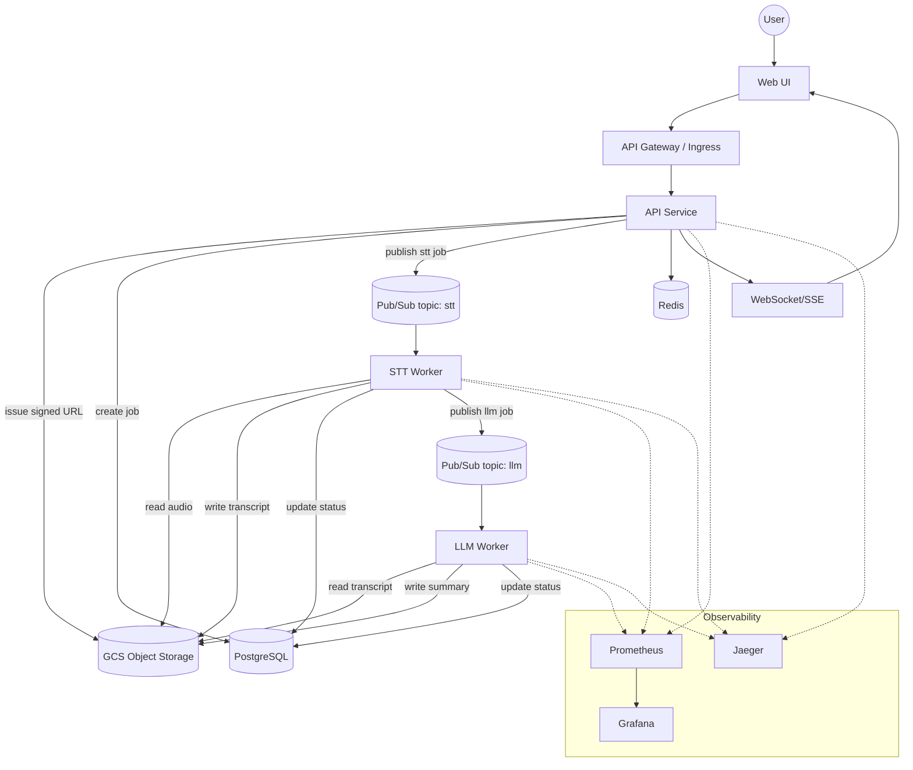
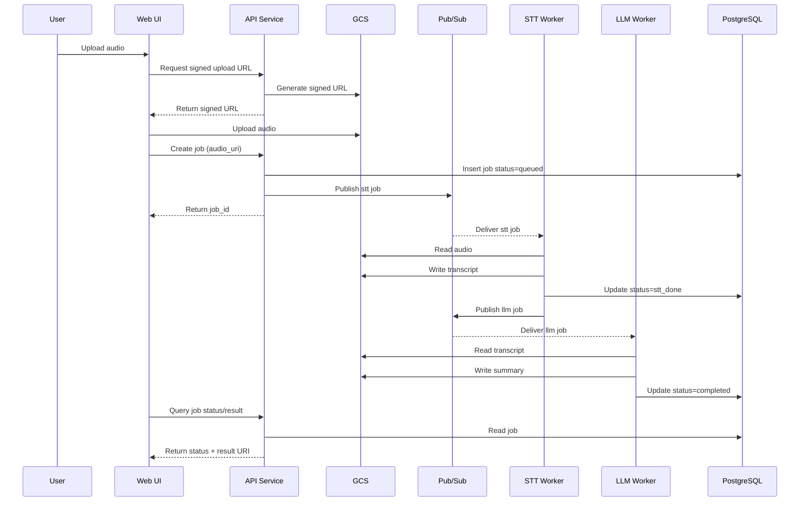
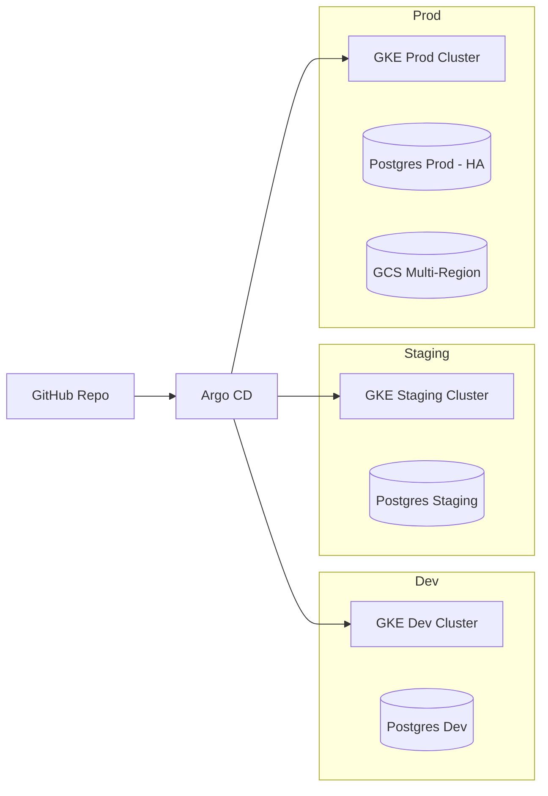
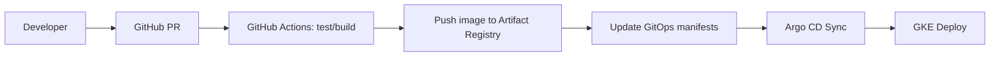

# HephAI AI Processing Platform 系統設計

版本: 0.1
日期: 2026-01-16

## Problem Statement
本文件設計一個可擴充、可維運的 AI 任務處理平台，支援「上傳音訊 → STT → LLM 摘要 → 儲存 → 查詢」的核心流程，並在高併發與雲端環境下具備可觀測性、容錯與成本控管。

## Requirements (Functional)
- 使用者可上傳音訊並建立任務，取得可查詢的 job_id。
- 系統需完成 STT 轉文字、LLM 摘要，並保存中間與最終結果。
- 使用者可查詢任務狀態與結果。
- 支援高併發處理與任務排隊。
- 提供可觀測性與監控（log/metrics/tracing/alerting）。

## Constraints
- 雲端平台: GCP
- 容器編排: GKE (Kubernetes)
- CI/CD: GitHub + GitOps + Argo CD
- 監控/追蹤: Prometheus + Grafana + Jaeger
- 語言: Go
- DB: PostgreSQL
- Cache: Redis
- Queue: GCP Pub/Sub
- 圖表: Mermaid
- 模型部署方案需符合「預算有限」前提

## Non-Functional Requirements
- 可擴充性: 水平擴展 worker 與 API。
- 容錯性: 支援自動重試、降級與故障隔離。
- 資料一致性: 任務狀態正確、結果可追溯。
- 延遲與效能: 透過非同步處理降低前端等待時間。
- 安全性: 檔案與 API 存取控管、加密與稽核。
- 可觀測性: Trace/metrics/log 整合與告警。

## Scope Boundaries
- In scope: STT/LLM 任務處理平台設計、部署與監控策略。
- Out of scope: 實作完整後端、提供可執行 demo、實際模型訓練。

## Assumptions
- 音訊檔案大小與格式有上限，超過將拒絕或需拆段處理。
- 任務為非即時需求，結果可非同步取得。
- 初期每日/每月量級不明，以可水平擴展設計對應波動。

## Architecture Overview

### Component Boundaries
| 模組 | 職責 | 備註 |
| --- | --- | --- |
| Web UI | 上傳音訊、查詢狀態與結果 | 可選擇只提供 API |
| API Service | 驗證、建立任務、提供查詢 | Go + REST
| Ingress/API Gateway | 流量入口、TLS、WAF、限流 | GCLB + Ingress
| Object Storage | 儲存音訊/文字/摘要 | GCS
| Task Orchestrator | 任務狀態控管、Pub/Sub 發佈 | 由 API 或獨立服務負責
| STT Worker | 讀取音訊、產生逐字稿 | 可多副本
| LLM Worker | 讀取逐字稿、產生摘要 | 可多副本
| PostgreSQL | 任務與結果 metadata | Cloud SQL 或自管
| Redis | 熱資料快取、短期狀態 | 避免重查 DB
| Pub/Sub | 任務佇列 | topic: stt, llm, dlq
| Observability | metrics/tracing/logging | Prometheus/Grafana/Jaeger

### System Architecture Diagram

### Task Sequence Diagram

## Data Model (Minimal)
- jobs
  - id (UUID)
  - status (queued, stt_running, stt_done, llm_running, completed, failed)
  - audio_uri, transcript_uri, summary_uri
  - error_reason, created_at, updated_at

## Tech Choices & Rationale (with Trade-offs)

### GCP + GKE
- Pros: 原生支援 Pub/Sub、GCS、Cloud SQL；GKE 可穩定水平擴展。
- Trade-off: GKE 維運成本高於純 Serverless；需處理叢集安全與升級。

### Go (API/Workers)
- Pros: 高效能、低記憶體、適合高併發任務處理。
- Trade-off: 開發效率可能低於腳本語言，需明確架構規範。

### PostgreSQL
- Pros: 強一致、交易支持、易於做狀態機。
- Trade-off: 高併發下需 careful indexing 與垂直/水平分片策略。

### Redis
- Pros: 快取 hot data、降低 DB 壓力、支援 rate limiting。
- Trade-off: 非持久資料，需容忍 cache miss 與一致性延遲。

### Pub/Sub
- Pros: 高吞吐、天然支援重試與 DLQ。
- Trade-off: 至少一次投遞，必須做 idempotency 設計。

### Observability: Prometheus + Grafana + Jaeger
- Pros: 自主可控、標準化、社群成熟。
- Trade-off: 需自建與維運；長期儲存需規劃。

## Architecture Decision Summary (ADR-lite)
- 任務處理採非同步 + Pub/Sub，以隔離前端峰值流量並提升可擴展性。
- 結果與中間檔案存於 GCS，資料庫只保存 metadata 以降低 DB 壓力。
- Worker 分離 STT 與 LLM 流程，支援獨立擴容與成本控管。
- 觀測性以 Prometheus/Grafana/Jaeger 統一，提供跨服務 trace 與告警。

## Model Serving Strategy (Budget Limited)

### 建議方案: 低成本混合模式
- 初期: 採用託管 API 模式（如 GCP Speech-to-Text + Vertex AI / Gemini），依量計費。
- 成本控制: 設定最大音訊長度、轉錄語言範圍、摘要長度與並行數上限。
- 量增後: 在 GKE 建立 GPU spot/preemptible node pool，自託管開源模型（Whisper small/medium + LLM quantized）。

### Trade-offs
- 託管 API: 上線快、維運低，但單位成本較高且受限於供應商。
- 自託管模型: 成本可控、資料可控，但需要 GPU、MLOps 與效能調校。

## Architecture Characteristics

### 可擴充性
- API 與 Worker 皆使用 HPA 水平擴展。
- Pub/Sub 解耦前端流量與後端計算。

### 容錯性
- Pub/Sub 重試 + DLQ。
- Worker 設計 idempotent，避免重複處理造成錯誤。
- 任務狀態寫入 DB 具交易性。

### 資料一致性
- 使用 DB 交易更新狀態與結果 URI。
- 以 job status state machine 管控流程。

### 延遲與效能
- 前端非同步查詢，避免長連線等待。
- Redis cache 加速 status/result 查詢。

### 安全性
- GCS signed URL 上傳，避免直通 API。
- JWT/API Key + Rate limit。
- TLS in transit + KMS at rest。
- 最小權限 IAM。

### 可觀測性
- Prometheus metrics (request latency, queue depth, worker success/fail)。
- Jaeger trace 追蹤跨服務任務。
- Grafana dashboard + Alertmanager。

## Deployment & Operations

### Dev / Staging / Prod Topology

### CI/CD Flow (GitOps + Argo CD)

### Release & Rollback
- 使用 GitOps: 版本即 Git commit，回滾即 revert。
- 服務採 Rolling update，重要功能可用 canary/blue-green (Argo Rollouts)。
- DB migration 使用 backward-compatible schema；必要時提供 downgrade script。

## Monitoring & Alerting
- Prometheus: scrape API/Worker metrics + node metrics。
- Grafana: Dashboard + Alertmanager routing。
- Jaeger: Trace pipeline。
- Logs: 建議整合 Cloud Logging 或 Loki。

## Bonus Considerations (不實作)
- 多區部署: GKE multi-zone + GCS multi-region。
- CDN: 靜態 Web UI 透過 Cloud CDN。
- Plug-in 任務: 定義 task pipeline schema (STT/LLM/Translation/QA) 可插拔擴充。
- CI/CD + 測試: 擴展到 integration test + load test。

## Open Questions (HITL Gate)
1. 音訊檔案大小與格式是否有明確限制？
2. 需要即時進度回饋 (WebSocket/SSE) 嗎？
3. 是否有多語言 STT/LLM 需求？
4. 結果保存期限與合規要求？

## Tech Choice Questions
- STT/LLM 供應商: GCP managed API vs 自託管 open-source
- Web UI 是否需要正式產品級？或僅 API

---
以上方案已符合指定技術選型與需求，若有額外限制可進一步調整。
