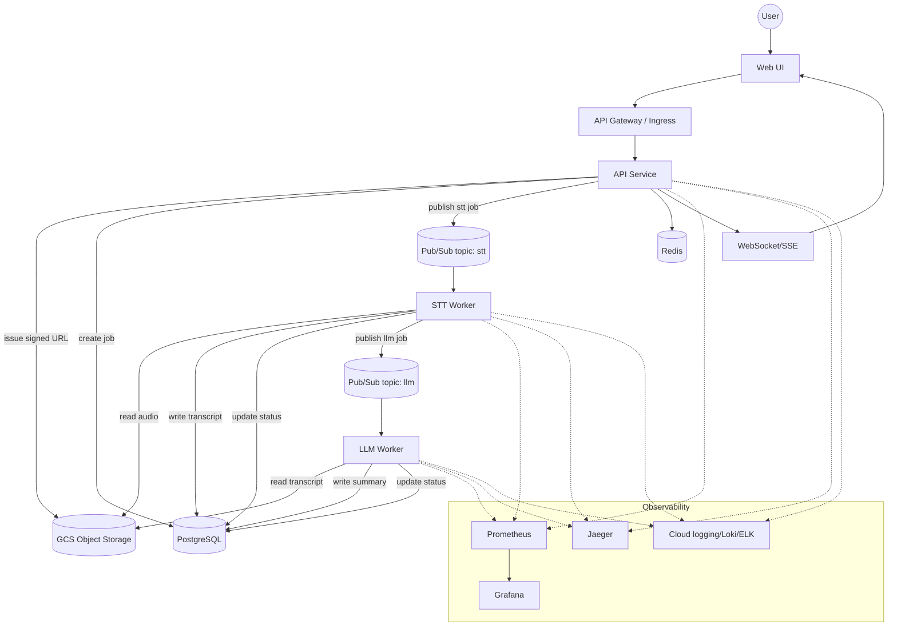
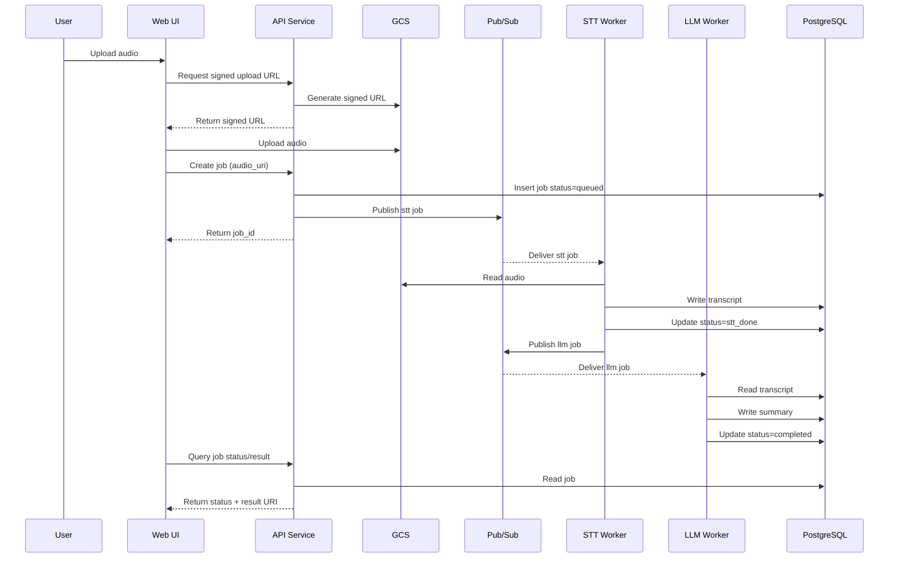
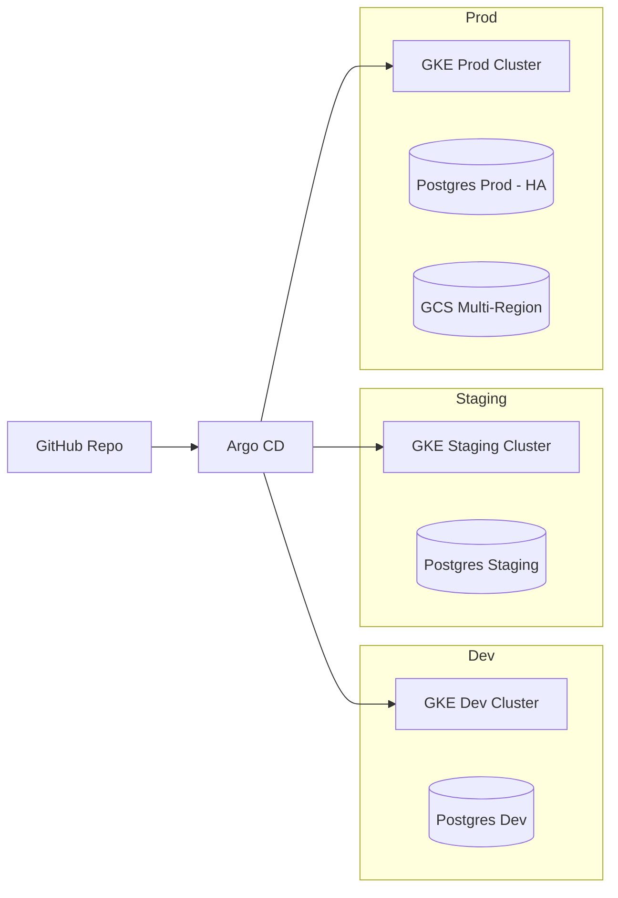
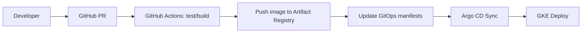
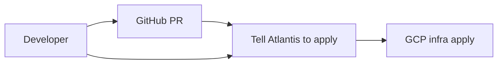

# STT Platform 系統設計

## Problem Statement

這邊設計一個可擴充、可維護的 AI STT 處理平台，支援「上傳音訊 → STT → LLM summary → 儲存 → 查詢」的核心流程，並在高併發與雲端環境下具備可觀測性、容錯與成本控管

## Functional Requirements

- 使用者可以上傳音訊並建立 job，取得可查詢的 job_id
- 完成 STT 轉文字、LLM summary，並保存中間與最終結果
- 使用者可查詢 job 狀態與結果
- 支援高併發處理與 job 排隊
- 提供可觀測性與監控（log/metrics/tracing/alerting）

## Non-Functional Requirements

- 可擴充性: 水平擴展 worker 與 API
- 容錯性: 支援自動重試、降級與故障隔離
- 資料一致性:  job 狀態正確、結果可追溯
- 延遲與效能: 透過非同步處理降低 client latency
- 安全性: 檔案與 API access 控管
- 可觀測性: Trace/metrics/log/alert

## Constraints

- 雲端平台: GCP
- 容器編排: GKE (Kubernetes)
- CI/CD: GitHub + GitOps + Argo CD
- Monitoring/Tracing: Prometheus + Grafana + Jaeger
- 語言: Go
- DB: PostgreSQL
- Cache: Redis
- Queue: GCP Pub/Sub

## Assumptions

- 音訊檔案大小與格式有限制，超過限制考慮 reject 或 partial 處理
- job 為非 realtime 需求，可以 async 處理
- RPS 量級不確定，保留可水平擴展設計空間

## Architecture Overview

### Component Boundaries

| 模組 | 職責 | 備註 |
| --- | --- | --- |
| Web UI | 上傳音訊、查詢狀態與結果 | 可選擇只提供 API |
| API Service | 驗證、建立 job、提供查詢 | Go + RESTful API |
| API Gateway | 流量入口、TLS、WAF、ratelimit | GCLB + NEG |
| Storage | 儲存音訊 | GCS |
| Task Orchestrator | job 狀態控管、Pub/Sub 發佈 | 獨立 eventbus service |
| STT Worker | 讀取音訊、產生 transcript | 獨立 service |
| LLM Worker | 讀取 transcript、產生 summary | 獨立 service |
| PostgreSQL | job，transcript，summary 資料 | Cloud SQL |
| Redis | cache | hot data cache 來保護 DB |
| GCP Pub/Sub | job queue | topic: stt, llm, dlq |
| Observability | metrics/tracing/logging | Prometheus/Grafana/Jaeger/Loki or ELK |

### System Architecture Diagram



### Task Sequence Diagram



## Data Model (Minimal)

- jobs

  ```sql
  CREATE TABLE IF NOT EXISTS jobs (
    id uuid PRIMARY KEY,
    status text NOT NULL CHECK (status IN ('pending', 'processing', 'completed', 'failed')),
    original_filename text NOT NULL,
    audio_path text NOT NULL,
    transcript text,
    summary text,
    error text,
    created_at timestamptz NOT NULL DEFAULT now(),
    updated_at timestamptz NOT NULL DEFAULT now(),
    expires_at timestamptz NOT NULL
  );
  ```

## Tech Choices & Reason

### GCP + GKE

- Pros: 原生支援 Pub/Sub、GCS、Cloud SQL；GKE 可穩定水平擴展
- Cons: GKE 維運成本高；需處理 cluster 安全與升級，成本考量的話也可以考慮某些服務 serverless 但是就不好穩定水平擴展

### Go (API/Workers)

- Pros: 高效能、低記憶體、適合高併發 job 處理（goroutine 輕量化）
- Cons: 屬於強語言，開發效率可能低於弱語言（ts, python）

### PostgreSQL（or MySQL）

- Pros: 強一致、transaction
- Cons:
  - 高併發下 indexing and locking 要處理好與垂直
  - 資料量大需要考慮 partition or sharding 策略
  - DB data or schema migration 不易

### Redis

- Pros: cache hot data、降低 DB 壓力
- Cons: 非持久資料，需 maintain cache hitting rate 與一致性延遲（看業務需求）

### Pub/Sub

- Pros: 高吞吐、天然支援重試與 DLQ
- Cons:
  - At least once 策略，job 必須做冪等設計
  - Flow 上需接受最終一致性，雖然跨服務需要強一致性時可以用 SAGA pattern 處理，但是實作不易也不好 maintain

### Observability: Prometheus + Grafana + Jaeger

- Pros: 自主可控、標準化
- Cons: 需自建與 maintain；長期儲存需規劃（prometheus GCP 有替代方案）

## Architecture Decision Summary（ADR 第一版）

- job 處理採非同步 + Pub/Sub，以削弱前端高峰流量並提升可擴展性
- Worker 分離 STT 與 LLM 流程，支援獨立擴容與成本控管與觀測
- 觀測性以 Prometheus/Grafana/Jaeger/Loki 統一，提供跨 service trace 與 alert
- 目前需求可以保持最終一致性，並沒有強一致性需求，以用戶體驗為第一優先

## Model 部署 Strategy

### 建議方案

- 前期: 因為 MVP 功能簡單，並不需要太複雜的 model fine tune or agentic flow，因此可以採用 LLM API 模式（如 GCP Speech-to-Text + Vertex AI / Gemini / OpenAI / Claude），依 Token 計費
- 成本控制: 設定最大音訊長度、檔案大小、接受語言範圍、summary 長度
- 後期成長後: 可以考慮在 GKE 建立 GPU spot node pool，自架開源模型（Whisper small/medium + LLM quantized）

### Trade-offs

- LLM API: 上線快、不需 maintain，但單位成本較高且效果依賴於模型廠商
- 自架模型: 成本可控、資料可控，但需要 GPU、MLOps 與效能調校（額外人力成本）

## Architecture Summary

### 可擴充性

- API 與 Worker 皆使用 HPA 水平擴展
- Pub/Sub 解耦前端流量與 async flow

### 容錯性

- Pub/Sub 重試 + DLQ
- Worker job 設計冪等性，避免重複處理造成錯誤
- job 狀態寫入 DB 具 transaction 特性
- 自架設的 k8s component 可以設定至少多少 % 數量服務需要是健康的確保服務正常
- 自架設的 k8s component 上線使用 rolling update，重要功能可用藍綠部署或是金絲雀部署 (Argo Rollouts)
- Job 觀測因為 Pub/Sub 有天生 retry 功能，可以安插監控確認 topic 是否有積壓情況發 alert 讓人為介入處理 or 使用 DLQ 方案

### 資料一致性

- 有 Race condition 風險情境使用 DB transaction 更新狀態
- 以 job status state machine 管控流程
- 設計業務邏輯能接受最終一致性
- 跨服務需要強一致性時使用 SAGA pattern 作補償

### 延遲與效能

- 前端 async or websocket 查詢狀態，避免長連線等待
- Redis cache 加速 status/result 查詢（optional）

### 安全性

- GCS signed URL 上傳，避免直通 API
- 若有 User feature 使用 JWT/API Key + Rate limit（GCP loadbalance）
- TLS in transit + KMS at rest
- k8s or IaaS 最小權限 IAM

### 可觀測性

- Prometheus metrics
  - request latency, queue depth, worker success/fail
  - GKE node, pod 等 resource metric
  - Web UI metric (LSP, eventloop blocking, etc)
- Jaeger trace 追蹤跨 service job or 跨程式 layer span
- Grafana dashboard + Alertmanager

### 其他

- 原始檔案 GCS 可以設定 retention 策略設定定期清理過期檔案

## Deployment & Operations

### Dev / Staging / Prod



### CI/CD Flow (GitOps + Argo CD)

#### GKE flow



#### GCP flow



## Bonus Considerations

- 多 region 部署: GKE multi-zone + GCS multi-region
- CDN: 靜態 Web UI or 靜態檔案透過 Cloud CDN
- Plug-in job : 定義 task pipeline schema (STT/LLM/Translation/QA) 可插拔擴充
- CI/CD + 測試: QA 可擴展到 integration test + E2E test
- 針對細節優化：
- 可考慮將 transcript 跟 summary 結果另外儲存（GCS or NoSQL DB）隔離寫入 transcript 跟 summary 的功能影響 SQL DB 的效能
